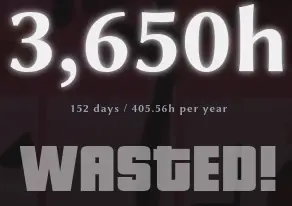

Even though I was born in 2005, my family got our first computer when I was about 6. I remember my shock when I found out that I could watch videos without physically buying them. The point is I can still remember times without the internet. I feel really bad for kids whose parents gave them a tablet or phone when they learned to scroll videos on them.

## The problem

Teenagers like me are mostly raised on the Internet. In my past life, I almost don't remember being bored and you probably know why. Whenever I felt like doing nothing I just watched a YouTube video. Of course, as time went by, it got worse. Jumping from YouTube to Reddit every morning for hours was normal.

At least for me, It was like an illusion of being productive. I thought I was getting some knowledge from all those things but the truth is I didn't. I wasted I'd say about 1/4 a day for absolutely nothing every day for about 4-5 years. Of course, there are a portion of things I think are valuable but still, were 9k+ hours worth spending for idk 100 of them?

## What about games?

I'd say that they're much better. That's because of an interaction, not just passive consumption. Developing a skill, even in a game, is much more beneficial. Obviously, certain types of games can teach you something useful, e.g. strategic, and this time putting many hours into them will teach you something.

Another aspect, they are also very rewarding and enjoyable (if you're not playing league!). I can't describe a feeling of joy when you just won after trying for many hours (I love souls-likes). Or playing some competetive games with your friends, trying your best to win. Even after losing to a worthy opponent I don't feel bad, I just think what we did wrong.

If you like a game, treating it as a passion isn't bad. I'd say it's a normal hobby. Just don't let it influence your goal in this world.

## So what do I do?

I proudly can say that I've reduced my addiction to a minimum. I use it **only** to do something specific. No "I'll open youtube and we'll see". Just as a tool. And I want to give you some tips if you think I can help you.

Firstly, define yourself. If you want to change, you better want it 100%. Nothing in between. If you don't then you'll almost always fail. You want your future self to know that you've decided and there will be no doubts about that.

You'll face boredom. Not the fake one you have been facing before but the pure one. And that's completely normal. The thing about internet addiction is it's not that hard to break actually. That's because it'll only get simpler. It's not like other addictions that'll force you more as time goes by. When you are in that state maybe read a book, talk to someone or go for a walk. If you resist it, it'll only get easier and that's a huge plus.

Let yourself think. Your mind will give you some thoughts to analyze in and out. And you don't want to postpone them. Just let yourself be and ponder.

In difficult times just think about the goal. I promise you'll thank me. It sounds like kind of a cult and that's true. Cult of humans who can think.

If you're struggling with one please consider abandoning the internet and just being in real life. Using it just as a tool to communicate or run errands. And hey, you can do it!
