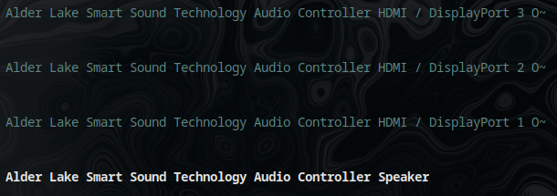

Yo, today's article gonna be short, just for folk out there having this awfully compatible with Linux laptop. Unfortunately, this involves patching a kernel. It's not hard, but time-consuming. I'll walk you through this. Everything here is based on [this GitHub repo](https://github.com/Jerryxia32/envy_x360_fix/). It's originally for a 6.1.62 kernel and also contains a fix for suspend/resume, which I don't care about, so if you want that, you have to do it yourself. Let's get into it.

## Patching the kernel (only for Arch)
This patch is for the 6.7.2 Arch kernel (but it will definitely work with the normal one; not tested tho), and the instructions below are for the [Arch build system](https://wiki.archlinux.org/title/Arch_build_system), so if you are running for, e.g., Debian, you gotta do it manually or in a way your distro supports.

1. Install the devtools and base-devel packages.
```sh
$ sudo pacman -S devtools base-devel pacman-contrib
```

2. Get PKGBUILD for 6.7.2
```sh
$ pkgctl repo clone --protocol=https --switch="6.7.2.arch1-2" linux
```

3. Go into the `linux` folder and copy the [patch](https://raw.githubusercontent.com/D00NIK/hp-envy-x360-13-bf0xxx-sound-fix/970715cf4ba4b6a3e56966179014b3dafcb63f07/0001-sound-fix.patch) to it.

4. Modify the name for the kernel in `PKGBUILD`. Name it as you want, e.g.:
```conf
pkgbase=linux-sound
```

5. In the same file, add the patch to `source`, be sure that it equals the file name e.g.:
```conf
source=(
  https://cdn.kernel.org/pub/linux/kernel/v${pkgver%%.*}.x/${_srcname}.tar.{xz,sign}
  $url/releases/download/$_srctag/linux-$_srctag.patch.zst{,.sig}
  config  # the main kernel config file
  0001-sound-fix.patch
)
```

6. Now update checksums and start compiling (might take a few hours, 2 and a half in my example):
```sh
$ updpkgsums && makepkg -s # Do not run as root
```

7. Now you should have a few new files in your `linux` dir, install two of 'em with pacman:
```sh
$ sudo pacman -U linux-sound-6.7.2.arch1-2-x86_64.pkg.tar.zst linux-sound-headers-6.7.2.arch1-2-x86_64.pkg.tar.zst
```

8. Now just update your bootloader and reboot! Using grub:
```sh
$ sudo grub-mkconfig -o /boot/grub/grub.cfg
```

## Adding Cirrus firmware
Clone it and copy `linux-firmware/cirrus` to `/lib/firmware/`:
```sh
$ git clone https://github.com/CirrusLogic/linux-firmware.git
$ sudo cp -r linux-firmware/cirrus /lib/firmware
```

and reboot!

## End


That's it; now you should be able to use your speakers! Also, be sure that you do **NOT** have any fixes from various sources in your `/etc/modprobe.d/` or any other changes, like those using `hdajackretask`.

For example, in pulsemixer my speakers are named „Alder Lake Smart Sound Technology Audio Controller Speaker”, weird but they work, hope your too!
