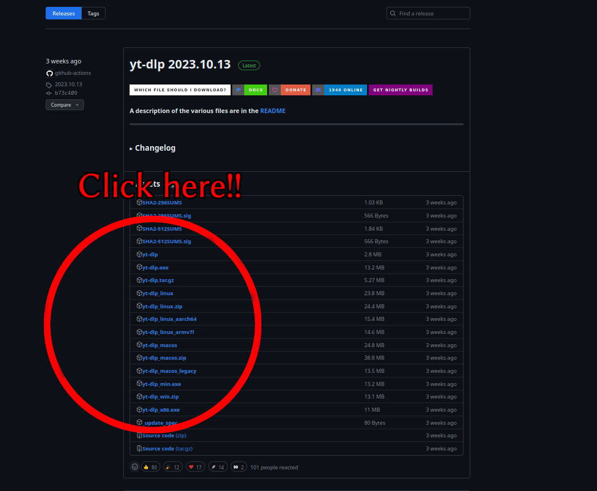

Recently, I was in a situation where I wanted to download some videos to watch offline. It actually reminded me of my past self, who typed something along the lines of "YouTube to MP4" in a browser and had to navigate those trash websites. This article is dedicated to those who still do it that way.



## Preparation

You can actually do it in one simple line (with previous preparation, though). Just go [here](https://github.com/yt-dlp/yt-dlp/releases) and download the latest release by clicking a file with:

- yt-dlp.exe - if you're using Windows
- yt-dlp_macos - if you're using macOS
- yt-dlp - if you're using Linux (but you can also probably download it from your package manager, e.g. Arch-based `pacman -S yt-dlp`)


Now you want to open your terminal (in Windows, just right-click in file explorer and "Open in Terminal") where your downloaded file is located (if you have downloaded it directly), and you're ready to go!

Note: For some audio extraction, you also need to download [FFmpeg](https://www.ffmpeg.org/download.html) which is a great tool for video manipulation overall.

## Usage

### Basic

If you haven't used a terminal before, don't be scared! It's much easier than you think!

Just type:

```bash
yt-dlp(.exe|_macos) "YOUTUBE_LINK"
```

And press enter! (Add .exe or _macos depending on your file name. It's just a name your file has! It should automatically download a YouTube video with the .webm extension. Your video player should automatically pick it up, but if you prefer, e.g., mp4, just add a `-f format` flag like this:

```bash
yt-dlp(.exe|_macos) -f mp4 "YOUTUBE_LINK"
```

And another note! You can also put a playlist link instead of a direct one, and it'll download every video in it.

### Extracting audio
*requires FFmpeg*

Just add an `-x` argument. That's it!

```bash
yt-dlp(.exe|_macos) -x "YOUTUBE_LINK"
```

By default, it'll be in .opus format, change it with `--audio-format format`:

```bash
yt-dlp(.exe|_macos) -x --audio-format mp3 "YOUTUBE_LINK"
```

### Subtitles

Get a list of available subtitles with `--list-subs`:

```bash
yt-dlp(.exe|_macos) --list-subs "YOUTUBE_LINK"
```

And if you've decided which to use, simply add `--write-subs --sub-langs langs`:

```bash
yt-dlp(.exe|_macos) --write-subs --sub-langs de "YOUTUBE_LINK"
```

Get automatically generated subs with `--write-auto-subs`

```bash
yt-dlp(.exe|_macos) --write-auto-subs --sub-langs "de, pl" "YOUTUBE_LINK"
```
You can pass multiple languages to `--sub-langs`, but do not forget about quotation marks!

## It wasn't that hard, was it?

It's just as simple as it can be. But this tool is much more extendable, if you have special needs, it is probably doable just with the [options available](https://github.com/yt-dlp/yt-dlp#usage-and-options).

So yeah, no "YouTube to MP3" from now on.